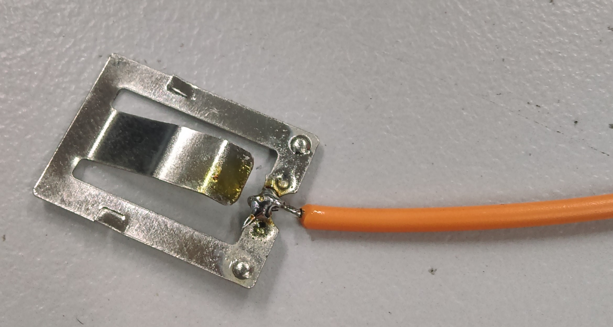
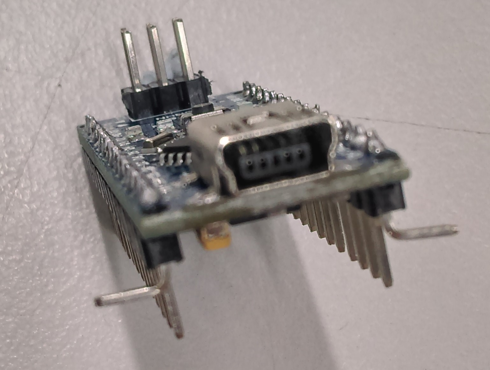
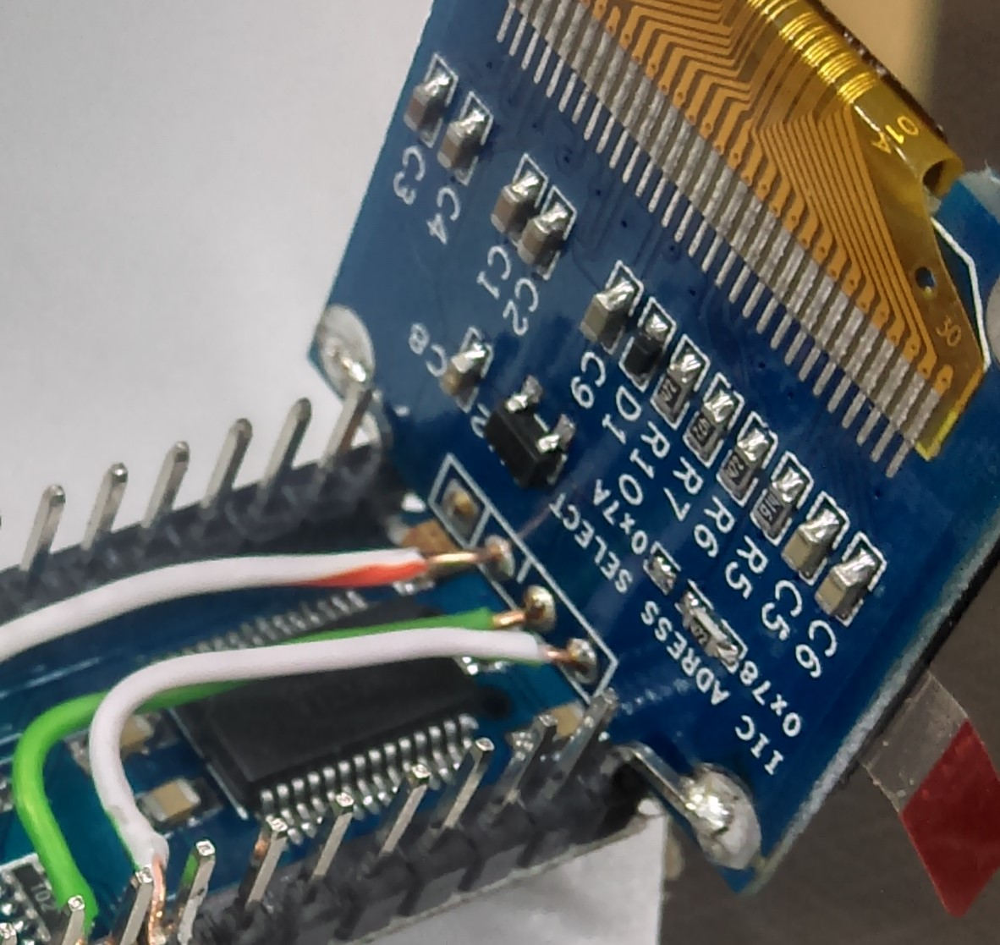
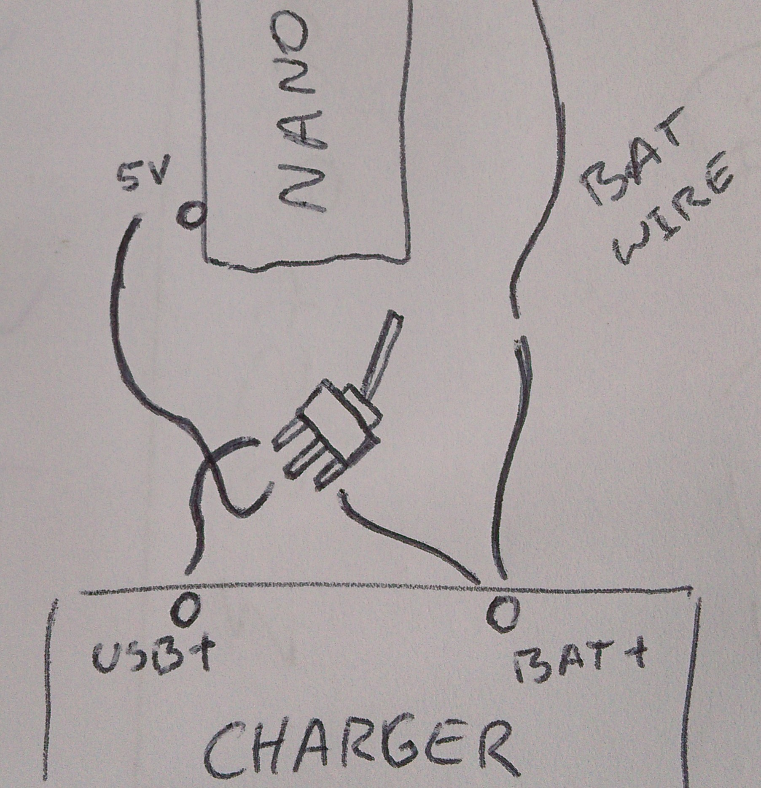
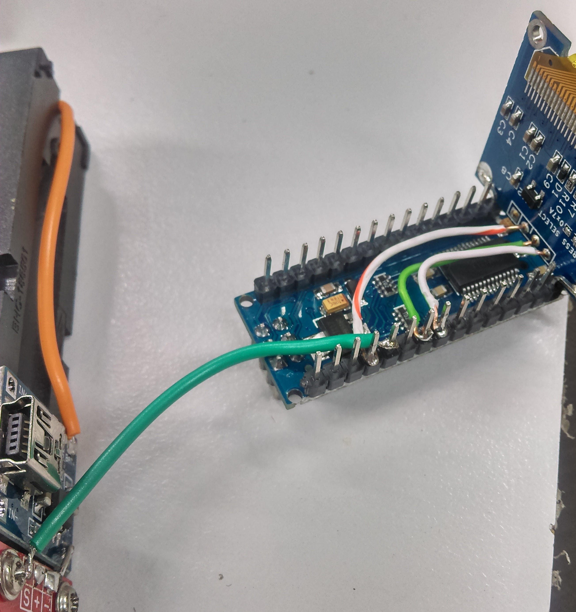
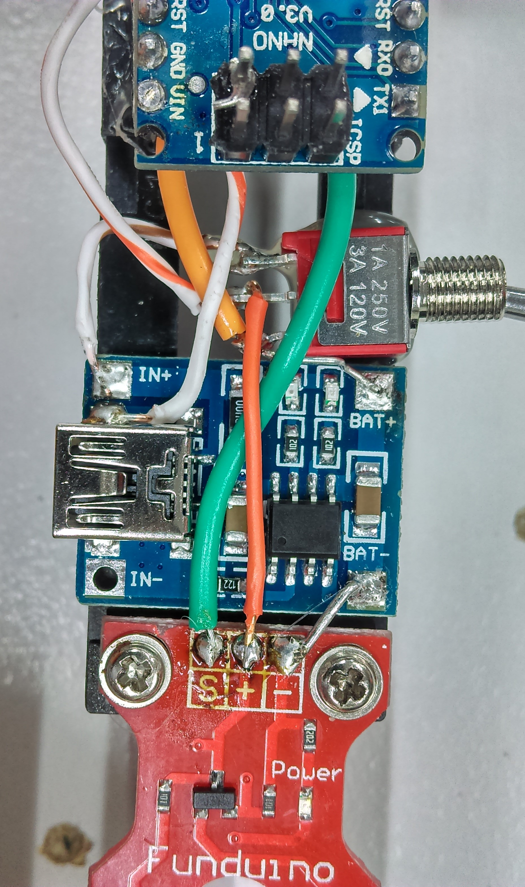

# Portable Soil moisture meter
_test and measure_
### Author: D.West :+1:

This is a great little tool for the green thumbs. Using a nano, OLED screen and
rechargable battery pack, you can make this portable soil moisture meter to take
around the garden.

## Bill of Materials
|Qty|Code|Description|
|---:|---|---|
|1|[PH9205](jaycar.com.au/p/PH9025)| Battery holder for our 18650
|1|[XC4414](jaycar.com.au/p/XC4414)| Duinotech Nano
|1|[XC4604](jaycar.com.au/p/XC4604)| Soil Moisture sensor
|1|[SB2307](jaycar.com.au/p/SB2307)| 18650 battery
|1|[XC4502](jaycar.com.au/p/XC4502)| Lithium battery USB charger
|1|[XC4384](jaycar.com.au/p/XC4384)| OLED module
|1|[ST0300](jaycar.com.au/p/ST0300)| SPDT switch
|1|[WB2022](jaycar.com.au/p/WB2022)| 1 meter of cat cable for hookup (or you can use your own)
| | | some small screws for mounting|

## Software Libraries
|Library|Author|
|---|---|
|GFX | who else but Adafruit |
|SSD1306 |Adafruit|

## Connection table
| Nano | OLED | Soil sensor | Battery charger|
|---|---|---|---|
|A4|SDA|||
|A5|SCK|||
|A6||S||
|5V|VCC|+||
|GND|GND|-|IN- (or BAT- )|

The SPDT switch is connected as follows:

|(charger) BATT+|(Nano) 5V| (charger) IN+|
|---:|---|---|

This is so the unit will either power 5v -> charger IN+ when it is turned off and plugged in.
or run off battery when turned on.

# __Note: Do not run off USB while also running off Battery__
this is a direct connection from 5VUSB to battery, which will charge it, but won't stop
charging it when it needs to stop.

we tried using a diode but couldn't find one that had a sufficiently low dropout.
the battery is only 3.7 and we need every inch of that going to power the device.

## Assembly
This project was very much going through revisions right up until the 11th hour.
(I had thought to include a battery meter while I was walking it to the ad dept.)
##### Soil meter
This part needs to be the most integral, and can be screwed onto the base of the battery holder (negative side.)
unsolder the header connection on there and pull out the battery tab from the holder.
you can unsolder the wire that's there and use a lead of an unused resistor (or otherwise)
to make a solid solder connection going up from the battery base when you put it back in.
this also makes a solid connection straight through the negative terminal of the sensor
(do not solder until it's screwed in.)

Make sure that the screws do not affect the placement of the battery. you do have
a thin margin of where you can put the screws, and keep them short. Using a hand
drill like [TD2089](jaycar.com.au/p/TD2089) (also mentioned in wifi meter project)
is excellent for this.

Position the sensor so that the screw holes are on the thickest part of the plastic
and drill, screw down and make sure it's strong.

##### OLED screen
Unsolder the header on the OLED screen, be very careful with this, as if you
leave the hot iron on it too long, the copper will remove and the device will
become inoperable without forensic repair. A handy tip is to clip as much of the
headers off as you can using a big pair of cutters, and pull the black plastic
off which is holding them together.

Solder some solid core wire to VCC, SDA, and SCL pins, only about 2-3 inches are needed.

Bend the front two legs of the Nano (see picture) to make a sturdy holder for the
OLED, place the OLED on the nano legs so that the top screw holes mount over the bent
legs and the wires run along the underside of the Nano. (a [3rd hand](jaycar.com.au/p/TH1989) is helpful for this.)

Solder the screwholes to the legs. use a short lead to go from GND up and over to
the USB connection shell.

Trim and strip the wires so that they are just long enough to reach A4, A5, and ground solder
in place.

##### Battery charger

The battery charger is just glued into place just above the moisture meter. Use the negative wire coming up from the moisture meter to connect to the negative terminal of the battery charger (BAT-)

The positive lead will go to the battery charger and one of the switch's side terminals. A small diagram can demonstrate the isolation of the USB, charger, and battery power:

_this switch changes between connecting battery power to 5V, and the charger input to 5V, allowing to both run or charge the battery. care is needed not to feed USB power directly into the battery however: using a blocking diode would have been ideal, but there was too much of a voltage drop on an already under-volt'd system_

Glue the toggle switch in place just above the battery holder and solder the battery lead in place; you might have to trim it to size so there is not too much wire.

##### Connecting the two pieces together

Now that you have a NANO with a screen, and the unit with battery charger, you can solder a short wire to go from S on the moisture sensor over to pin A6 on the NANO.

_This picture is a picture of our first model, which did not include a switch and we made the sensor go to A7, but either A6/A7 is fine._

##### _measure twice, cut once_

This project took a lot of do-over and revisions, you can see how dirty our project has become from soldering and unsoldering all the wires. once the switch is in place and the nano is glued onto the board, make the final connections between the switch, charger, and nano power connections. (also ensure the sensor is getting positive power aswel)

You can see how dirty our final model is here:

Be sure to get some [Isoprop alcohol](jaycar.com.au/p/NA1066) to clean the board properly before you present it as a present to someone.

## Programming

Programming is as simple as downloading the source code [here](https://github.com/duinotech/portable-soil-moisture-meter/archive/master.zip) and running in arduino.

## Use
Really is as simple as turning it on and sticking it in the ground. we haven't tested the durability of it as we don't have any garden beds around, but it should be able to withstand some soft-soil and etc.

## Notes
There is a battery meter on it, but the unit can possibly die before the battery meter runs out, and it was added more as an after thought to demonstrate the concept.
